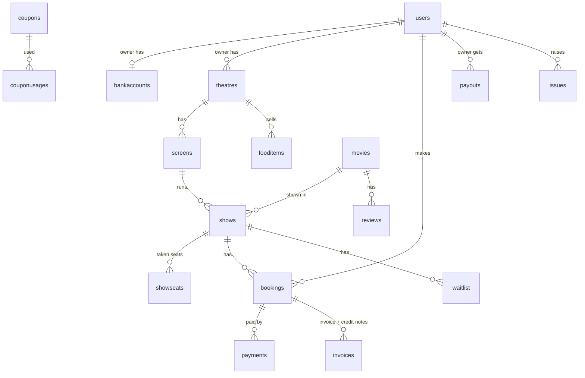

# Talkies – Database design

Version 1 · 2026-09-30 · Task 0.7 · **Developer review in task 0.9 before Phase 1**

MongoDB + Mongoose. This file lists every collection, its fields and its indexes. It is made from `docs/requirements.md`; the requirement IDs are in the notes.

---

## 1. Rules for all collections

- **Timestamps**: every collection has `createdAt` and `updatedAt` (Mongoose `timestamps: true`). They are not repeated in the tables below.
- **Sample data**: documents made by the seed script have `isSample: true` (15.5). Real documents do not have the field.
- **Time**: all dates are stored in UTC. They are shown in IST (Asia/Kolkata) (BR-21, NF-07). Things that depend on the local day or hour (show labels BR-22, "next 7 days", payout weeks) are calculated in IST.
- **Money**: all amounts are whole numbers in **paise** (₹30 = `3000`). Field names end with `Paise`. This avoids rounding errors. Percent values are plain numbers (`75` = 75%).
- **IDs**: `_id` is an ObjectId. A field that points to another collection ends with `Id` (for example `theatreId` → `theatres`).
- **Snapshots**: a booking copies the names, prices and rates it used (movie title, seat class names, GST rates, commission…). Later changes to settings or items do not change old bookings, tickets or invoices (A-05: "new values used in new bookings only").
- **Enums**: stored as lowercase strings (for example `pending`). The UI shows the nice text ("Pending").
- **Input**: all input is checked with Zod before it reaches the database. Keys that start with `$` or contain `.` are refused (SEC-06).
- **Secrets**: nothing secret is stored in plain text. Passwords use bcrypt (SEC-01), tokens are stored as a SHA-256 hash, and bank details are encrypted (SEC-12).

## 2. MongoDB must run as a replica set (transactions)

Confirming a booking changes 3+ collections at once (`showseats`, `bookings`, `payments`, plus `invoices`, `counters`, `coupons`). If one step fails, nothing may be half saved. So we use **multi-document transactions**, and MongoDB supports transactions only on a replica set.

| Where | Setup |
| --- | --- |
| Development | Docker `mongo:8` started with `--replSet rs0`, a single-node replica set (commands in `CLAUDE.md`). `MONGODB_URI=mongodb://127.0.0.1:27017/talkies?replicaSet=rs0` |
| Tests | `MongoMemoryReplSet` from `mongodb-memory-server` (1 member, `wiredTiger`), **not** `MongoMemoryServer`. Otherwise transactions fail in tests (task 0.11) |
| Deployment (Phase 12) | MongoDB Atlas free tier is already a replica set. Only `MONGODB_URI` changes |

Code uses `session.withTransaction(...)`, which retries by itself on temporary transaction errors.

**Where transactions are used**

| Action | Changes in one transaction |
| --- | --- |
| Hold seats (U-12) | Insert all `showseats` (held) + insert the `bookings` document (`pending`). If any seat is taken, the whole hold fails and no seat is held |
| Confirm booking (U-16) | `payments` → `success` · `showseats` held → booked · `bookings` → `confirmed` · `counters` +1 and insert `invoices` · `coupons.usedCount` +1 and insert `couponusages` · `shows.bookedCount` + seats |
| Cancel booking (U-20) | `bookings` → `cancelled` · delete its `showseats` · refund in `payments` · credit note in `invoices` (+ `counters`) · `shows.bookedCount` − seats |
| Show cancelled (O-06, JOB-04) | Per booking, the same steps as cancel, with 100% refund |
| Ticket transfer (SF-02) | `bookings` owner / QR nonce change + `transfer` data |

## 2a. Prices include GST – how GST is calculated back

All prices typed by owners and admin **include GST**: ticket prices, food prices and the convenience fee (₹200 = the user pays ₹200). The invoice shows the taxable value + CGST + SGST, **calculated back** from the price. Rates come from settings (BR-20). CGST + SGST are always of the theatre's state (11.3).

For each invoice line (amount = GST-inclusive total of the line, after discount):

```
taxable = round(amount × 100 / (100 + gstPercent))   // whole paise
gst     = amount − taxable
cgst    = floor(gst / 2)
sgst    = gst − cgst                                  // so taxable + cgst + sgst = amount exactly
```

- Example: ticket ₹200 (`20000` paise) at 18% → taxable `16949`, GST `3051`, CGST `1525`, SGST `1526`.
- Calculated per line (for example "2 × First class"), not per seat, and the totals are the sum of the lines. The invoice total is always exactly what the user paid.
- **Coupons and last-minute deals apply to tickets only** (not food, not the convenience fee). The ticket line is discounted first, then GST is calculated back from the discounted amount.
- **Base price** (BR-11 commission, payouts) = the taxable value, i.e. the price without the GST inside it.
- Refunds (BR-05, BR-06) are taken from GST-inclusive amounts; the credit note calculates GST back the same way.
- This logic lives in one backend module and is tested in T-05.

## 3. Seat locking – how it works (9.3, T-02, T-03)

- `showseats` has **one document per taken seat** in a show. A seat is taken when it is **held** or **booked**. No document = the seat is available. Blocked seats come from the layout and are never in `showseats`.
- The **unique index** `{ showId, seatId }` makes holding atomic: if two users hold the same seat at the same moment, MongoDB saves only one insert. The other gets a duplicate key error, and its transaction is aborted.
- A held seat has `expiresAt` (now + BR-01). A **TTL index** on `expiresAt` deletes held seats after they expire. A booked seat has no `expiresAt`, so the TTL index never deletes it.

> **Important: the TTL index is not exact.** MongoDB's TTL monitor runs only about **every 60 seconds** (and can be slower when the server is busy). An expired hold can still be in the collection for a minute or more.
> **So every seat check must also check `expiresAt > now` itself. Never trust the TTL alone.**
> - Reading the seat map: a document with `status: 'held'` and `expiresAt <= now` counts as **available**.
> - Holding: first delete the expired holds for these seats (`status: 'held', expiresAt: { $lte: now }`), then insert, in the same transaction.
> - Confirming: update only `{ bookingId, status: 'held', expiresAt: { $gt: now } }`. If the number of changed seats is not equal to the seats in the booking, the hold has expired → abort, and the payment is refunded (JOB-02).
> - JOB-01 (every minute) deletes expired holds too and pushes the seat updates with Socket.io, so viewers do not wait for the TTL monitor.
> - Tests (T-03) must not wait for the TTL monitor. They check the `expiresAt` logic with a fake "now".

## 4. How the collections link



## 5. Collections

22 collections: People (`users`, `authtokens`, `bankaccounts`) · Platform (`settings`, `counters`, `auditlogs`, `banners`) · Cinema (`movies`, `theatres`, `screens`, `shows`, `fooditems`) · Booking (`showseats`, `bookings`, `payments`, `invoices`, `coupons`, `couponusages`, `waitlist`) · Money (`payouts`) · Other (`reviews`, `issues`).

---

### 5.1 `users`

One collection for all 4 roles (Section 3). Role-specific data is in the `owner` and `staff` parts.

| Field | Type | Required | Notes |
| --- | --- | --- | --- |
| `name` | String | yes | |
| `email` | String | yes | Lowercase, trimmed, unique. Login is email + password only |
| `passwordHash` | String | yes | bcrypt (SEC-01). Password rule BR-18 is checked before hashing. Never sent to the browser |
| `passwordChangedAt` | Date | | Set when the password changes (U-03 reset; later also `POST /me/password`). `requireAuth` refuses an access token whose `iat` (whole seconds) is before it: `401 TOKEN_EXPIRED`. So a password change logs out all devices at once, not after up to 15 min |
| `role` | String | yes | `user` · `owner` · `staff` · `admin` |
| `phone` | String | owner: yes | O-01, U-25. 10 digits (Indian mobile, starts with 6–9), saved without `+91` |
| `emailVerified` | Boolean | yes | Default `false`. Login works only when `true` (U-01; owners too, O-01). Staff and seeded admin: `true` |
| `status` | String | yes | `active` · `blocked`. Blocked = cannot log in (A-07, A-03, O-09). Default `active` |
| `owner.businessName` | String | owner: yes | O-01 |
| `owner.approvalStatus` | String | owner: yes | `pending` · `approved` · `rejected` (ROLE-03). Default `pending` |
| `owner.rejectReason` | String | | A-03 |
| `owner.decidedBy` / `owner.decidedAt` | ObjectId → users / Date | | Admin who approved / rejected |
| `staff.ownerId` | ObjectId → users | staff: yes | The owner who created this staff login (ROLE-05) |
| `staff.theatreIds` | [ObjectId → theatres] | staff: yes | One or more theatres of that owner (ROLE-05). Used by the S-03 check |
| `prefs.theme` | String | | `auto` · `day` · `night` or `null`. Default `null` = not chosen yet (UI-02). At login: `null` → the device choice is kept and saved here; a choice here wins over localStorage |
| `prefs.sound` | Boolean | yes | Default `false` (UI-40) |
| `prefs.reduceMotion` | Boolean | yes | Default `false` (UI-41). The phone setting is also followed |
| `enteredCount` | Number | yes | Default `0`. +1 on each "Entered" scan (S-04). Used for badges |
| `badges` | [{ `code`, `earnedAt` }] | | `code`: `first_show` · `regular` · `silver_jubilee` · `golden_jubilee` · `diamond_jubilee` (BR-23, U-24) |
| `deletedAt` | Date | | U-26. See note |

**Indexes**
- `{ email: 1 }` unique
- `{ role: 1, 'owner.approvalStatus': 1 }` (A-03 pending owners list)
- `{ 'staff.theatreIds': 1 }`
- No text index: A-07 search uses a case-insensitive prefix search on `email` and `name`

**Notes**
- Delete account (U-26): `name` → `"Deleted user"`, `email` → `deleted-<_id>@deleted.invalid` (keeps the unique index working), `phone` and `passwordHash` removed, `status` → `blocked`, `deletedAt` set. Bookings and invoices stay, without personal details (see `invoices`).
- Wrong-login counting (BR-17) is done by `express-rate-limit` (key = email + IP), not stored in `users`.

---

### 5.2 `authtokens`

Email verify links, password reset links and refresh tokens (U-01, U-02, U-03).

| Field | Type | Required | Notes |
| --- | --- | --- | --- |
| `userId` | ObjectId → users | yes | |
| `type` | String | yes | `verify_email` · `reset_password` · `refresh` |
| `tokenHash` | String | yes | SHA-256 of the token. The real token is only in the email link / cookie |
| `expiresAt` | Date | yes | verify: 24 h (U-01) · reset: 30 min (U-03) · refresh: 7 days (BR-19) |
| `usedAt` | Date | | Verify and reset links work only once |

- Resend verify email (U-01): deletes the user's old `verify_email` tokens and makes a new one, so the old link stops working. Max 3 per hour (SEC-03).
- Forgot password (U-03): deletes the user's old `reset_password` tokens and makes a new one (30 min). A successful reset deletes all `refresh` and `reset_password` tokens of the user (all devices logged out) and sets `emailVerified: true` and `users.passwordChangedAt`.

**Indexes**
- `{ tokenHash: 1 }` unique
- `{ userId: 1, type: 1 }` (logout / password change deletes all refresh tokens of the user)
- `{ expiresAt: 1 }` TTL, `expireAfterSeconds: 0`. Also here: code checks `expiresAt > now`, because of the TTL delay

---

### 5.3 `bankaccounts`

Owner bank details for payouts (O-14). A separate collection, so that no normal `users` query can load them by mistake. Only the owner can see or change their own details, and nobody else sees more than the last 4 digits (SEC-12).

| Field | Type | Required | Notes |
| --- | --- | --- | --- |
| `ownerId` | ObjectId → users | yes | Unique: one bank account per owner |
| `accountName` | Encrypted | yes | |
| `accountNumber` | Encrypted | yes | |
| `ifsc` | Encrypted | yes | |
| `accountNumberLast4` | String | yes | Plain text, for display ("•••• 4321") |

- *Encrypted* = object `{ iv, tag, data }` (base64 strings), AES-256-GCM with `BANK_ENCRYPTION_KEY` from `.env` (SEC-07).
- The API never sends the decrypted account number, not even to the owner; only `accountNumberLast4`.

**Indexes**: `{ ownerId: 1 }` unique

---

### 5.4 `settings`

**One document** (`_id: 'platform'`) with all values the admin can change (Section 4, A-05). Every change also writes an `auditlogs` entry with the old and new values. Bookings copy the values they use (snapshot).

| Field | Type | Default | Rule |
| --- | --- | --- | --- |
| `holdMinutes` | Number | 10 | BR-01 |
| `maxSeatsPerBooking` | Number | 10 | BR-02 |
| `convenienceFeePaise` | Number | 3000 | BR-03, per ticket, GST included |
| `cancelCutoffMinutes` | Number | 120 | BR-04 |
| `userRefundTicketPercent` | Number | 75 | BR-05 (after discount) |
| `userRefundFoodPercent` | Number | 100 | BR-05 |
| `checkinBeforeMinutes` | Number | 30 | BR-08 |
| `defaultCleaningBreakMinutes` | Number | 15 | BR-09 (new screens start with this) |
| `commissionPercent` | Number | *empty* | BR-11. **Open question**: starting value |
| `waitlistOfferMinutes` | Number | 10 | BR-13 |
| `dealStartMinutes` | Number | 30 | BR-14 |
| `dealMaxPercent` | Number | 50 | BR-14 |
| `transferCutoffMinutes` | Number | 30 | BR-15 |
| `accessTokenMinutes` / `refreshTokenDays` | Number | 15 / 7 | BR-19 |
| `resetLinkMinutes` | Number | 30 | U-03 |
| `gst.ticketPercent` / `gst.foodPercent` / `gst.convenienceFeePercent` | Number | *empty* | BR-20. **Open question** (confirm with a CA) |
| `gst.hsnSac.ticket` / `.food` / `.convenienceFee` | String | *empty* | 11.3. **Open question** |
| `platform.companyName` / `.gstin` / `.address` | String | *empty* | 11.3 (platform on the invoice) |
| `uploadMaxMb` | Number | 2 | SEC-11 |
| `posterMaxWidthPx` | Number | 800 | NF-08 |
| `cities` | [{ `code`, `name`, `state` }] | seeded | **Fixed city list** (O-03, U-04): 10 cities (Hyderabad, Chennai, Bengaluru, Mumbai, Pune, Delhi, Kolkata, Kochi, Ahmedabad, Jaipur), decided 2026-10-01. Set by the seed script; there is no admin screen for it (not in the requirements). `code` e.g. `hyderabad`, `state` is the theatre's GST state (all invoice lines use CGST + SGST of this state) |

- Fixed rules that are **not** in settings (they never change, so they live in code): show labels BR-22, badge counts BR-23, time zone BR-21, payout day BR-12, coupon rule BR-16, review rule BR-24.
- BR-17 (wrong-login limit, 5 per 15 min) is **not** in settings: like all rate limits it lives in `server/src/config/rateLimits.js` (SEC-03; decided 2026-10-01).
- The seed script fills **TEST** values for commission, GST, HSN / SAC codes (`TEST-TICKET`, `TEST-FOOD`, `TEST-FEE`) and the platform company ("Talkies Sample Pvt Ltd (TEST)") only where they are still empty. The admin page shows a warning while TEST values are there. Replace them after asking a CA.
- Bookings cannot be created while `commissionPercent` or the GST values are empty (the seed script fills test values).

---

### 5.5 `counters`

Numbers that must go up one by one without duplicates (invoice series).

| Field | Type | Notes |
| --- | --- | --- |
| `_id` | String | e.g. `invoice:2026-27`, `credit_note:2026-27` |
| `seq` | Number | Last used number |

- Next number: `findOneAndUpdate({ _id }, { $inc: { seq: 1 } }, { upsert: true, new: true })`, inside the confirm / cancel transaction. So an aborted booking does not use up a number.
- Financial year = 1 April to 31 March, in IST.

---

### 5.6 `movies` (A-02)

| Field | Type | Required | Notes |
| --- | --- | --- | --- |
| `title` | String | yes | |
| `tagline` | String | | Optional, max 120 characters (A-02). Shown in the Home banner (UI-15) |
| `posterUrl` | String | yes | Cloudinary URL (NF-08). Development without Cloudinary keys: `/api/uploads/files/<name>` |
| `trailerUrl` | String | | |
| `cast` | [{ `name`, `photoUrl` }] | | UI-16 "photo cards"; `photoUrl` optional |
| `genres` | [String] | yes | At least 1, from the fixed list (A-02, `config/movieOptions.js`) |
| `languages` | [String] | yes | At least 1, from the fixed list (A-02, `config/movieOptions.js`) |
| `durationMinutes` | Number | yes | Used for show end time (BR-10) |
| `certificate` | String | yes | `U` · `UA` · `A` (U-08: `A` shows the 18+ warning) |
| `releaseDate` | Date | yes | 00:00 IST of the release day, stored in UTC (BR-21). The API uses the IST day `YYYY-MM-DD` |
| `status` | String | yes | `coming_soon` · `now_showing` · `inactive` |
| `ratingAvg` / `ratingCount` | Number | yes | Default 0. Updated when reviews change (U-07, U-23); hidden reviews do not count |

- A movie with shows or bookings cannot be deleted, only made `inactive` (A-02). Seeded movies have `isSample: true`. Owners can pick only movies that are not `inactive` (O-05).

**Indexes**
- `{ status: 1, releaseDate: 1 }` (home: now showing / coming soon)
- `{ title: 'text' }` (U-06 search by name)
- `{ genres: 1 }`, `{ languages: 1 }` (U-06 filters)

---

### 5.7 `theatres` (O-03, A-04)

| Field | Type | Required | Notes |
| --- | --- | --- | --- |
| `ownerId` | ObjectId → users | yes | ROLE-02 |
| `name` | String | yes | |
| `cityCode` | String | yes | Must be a `code` from `settings.cities` (no free text). Locked after approval |
| `address` | String | yes | |
| `mapLink` | String | | |
| `photos` | [String] | | Cloudinary URLs, max 6 |
| `gstin` | String | yes | Seller on the invoice (11.3). Must start with the GST state code of the city's state (`config/gstStates.js`). Locked after approval |
| `amenities.wheelchairAccess` / `amenities.parking` | Boolean | yes | Default `false` |
| `status` | String | yes | `pending` · `approved` · `rejected` (ROLE-04). Default `pending` |
| `rejectReason` | String | | A-04 |
| `decidedBy` / `decidedAt` | ObjectId → users / Date | | |

- The **user city picker** (U-04) = `distinct('cityCode', { status: 'approved' })`, with names from `settings.cities`.
- Editing a `rejected` theatre sets it back to `pending` (and removes `rejectReason`). Theatres are never deleted. Seeded theatres have `isSample: true`.
- The theatre's GST state = the `state` of its city in `settings.cities`. **Every invoice line (tickets, food, convenience fee) uses CGST + SGST of this state** (11.3). No IGST.

**Indexes**
- `{ ownerId: 1 }`
- `{ cityCode: 1, status: 1 }`
- `{ status: 1, createdAt: 1 }` (A-04 pending list)

---

### 5.8 `screens` (O-04)

| Field | Type | Required | Notes |
| --- | --- | --- | --- |
| `theatreId` | ObjectId → theatres | yes | |
| `ownerId` | ObjectId → users | yes | Copy from the theatre, for quick ownership checks (ROLE-02) |
| `name` | String | yes | e.g. "Screen 1" |
| `format` | String | yes | `2D` · `3D` |
| `cleaningBreakMinutes` | Number | yes | Default from `settings.defaultCleaningBreakMinutes` (BR-09) |
| `wheelchairFriendly` | Boolean | yes | **Automatic**: `true` when the layout has at least 1 wheelchair space (SF-08, decided 2026-10-04). Not sent by the client |
| `layout.rows` / `layout.cols` | Number | yes | Grid size: max 26 rows (A–Z) × 40 columns |
| `layout.grid` | [Row] | yes | One entry per row, see below |
| `seatCount` | { `balcony`, `first`, `second` } | yes | Number of seats per class, calculated when the layout is saved |
| `showLock` | Number | yes | Default 0. O-05: +1 inside every show save transaction, so two saves on one screen at the same moment cannot both pass the overlap check (T-08) |

**Row** = `{ label: 'A' | null, cells: [Cell] }`. `grid[0]` = the row farthest from the screen (top of the map); the screen is below the last row
**Cell** = one of:
- `{ type: 'seat', seatId: 'A4', seatClass: 'balcony' | 'first' | 'second', wheelchair: Boolean }`
- `{ type: 'aisle' }` (gap)
- `{ type: 'blocked' }` (never bookable)

- Row letters are made by the server (`utils/seatLayout.js`), never sent by the client: **A = the row with seats nearest the screen**, then B, C… Rows without seats get `label: null` and no letter (decided 2026-10-04).
- `seatId` = row label + seat number. Seats are numbered 1, 2, 3… left to right; aisles and blocked places are skipped. `seatId` is unique inside a screen.
- Screens can be added to `pending` and `rejected` theatres too (ROLE-04 still stops live shows). Screens are never deleted (decided 2026-10-04). Seeded screens have `isSample: true`.
- Class names shown to users (UI-22): `balcony` = "Balcony", `first` = "First class", `second` = "Second class".

**Indexes**: `{ theatreId: 1, name: 1 }` unique

---

### 5.9 `shows` (O-05, O-06, O-12)

| Field | Type | Required | Notes |
| --- | --- | --- | --- |
| `movieId` | ObjectId → movies | yes | |
| `theatreId` / `screenId` / `ownerId` | ObjectId | yes | |
| `cityCode` | String | yes | Copy from the theatre (U-04 browsing by city) |
| `startAt` | Date | yes | UTC |
| `endAt` | Date | yes | `startAt` + movie duration + cleaning break (BR-10) |
| `label` | String | yes | `morning` · `matinee` · `first` · `second`, from `startAt` in IST (BR-22) |
| `language` | String | yes | One of the movie's languages |
| `format` | String | yes | `2D` · `3D` |
| `subtitles` | Boolean | yes | SF-08 |
| `tags` | [String] | | `parent_baby` (SF-08). Never on an "A" certificate movie (O-05) |
| `wheelchairFriendly` | Boolean | yes | Copy from the screen (SF-08 filter) |
| `prices` | [{ `seatClass`, `pricePaise` }] | yes | Price per seat class in this screen, GST included (Section 2a) |
| `layout` | Same as `screens.layout` | yes | **Copy of the screen layout when the show is made**. Later layout edits do not break seats of existing shows |
| `totalSeats` | Number | yes | |
| `bookedCount` | Number | yes | Default 0. Changed in the confirm / cancel transactions. `bookedCount == totalSeats` → "Housefull" (U-09) |
| `deal.enabled` / `deal.percent` | Boolean / Number | | O-12. `percent` ≤ `settings.dealMaxPercent` |
| `deal.active` | Boolean | | Set to `true` by JOB-05 from `startAt − dealStartMinutes` (BR-14) |
| `status` | String | yes | `scheduled` · `cancelled`. A show is "completed" when `endAt < now` and not cancelled (used for payouts) |
| `cancelReason` / `cancelledBy` / `cancelledAt` | String / ObjectId / Date | | O-06. Not allowed after `startAt` (BR-07) |

**Overlap check (BR-10, T-08)**: a new show on a screen is refused when a show exists with the same `screenId`, `status: 'scheduled'`, `startAt < newEndAt` and `endAt > newStartAt`. Touching edges are allowed. The check runs in a transaction that first changes `screens.showLock`, so two saves at the same moment cannot both win.

**Create / edit rules (O-05, decided 2026-10-04)**: theatre `approved` (ROLE-04) · movie not `inactive` · `language` one of the movie's languages · `3D` only on a 3D screen (2D on 3D is fine) · one price for every seat class the screen has, whole rupees ₹1–₹5,000 · start in the future, at most 30 days ahead, not before the movie's release day · at most 14 dates per request. Edit only before the start and while the show has no bookings. Shows are not deleted (cancel = O-06).

**Indexes**
- `{ screenId: 1, startAt: 1 }` (overlap check)
- `{ cityCode: 1, status: 1, startAt: 1 }` (U-09 show list)
- `{ movieId: 1, cityCode: 1, startAt: 1 }` (movie → theatres and times)
- `{ theatreId: 1, startAt: 1 }` (owner lists, dashboards)
- `{ status: 1, endAt: 1 }` (payouts, completed shows)

---

### 5.10 `showseats` (U-10, U-12, 9.3)

See **Section 3** for the full locking rules.

| Field | Type | Required | Notes |
| --- | --- | --- | --- |
| `showId` | ObjectId → shows | yes | |
| `seatId` | String | yes | e.g. `F4`, from the show layout |
| `status` | String | yes | `held` · `booked` |
| `bookingId` | ObjectId → bookings | yes, except waitlist offer | The booking that holds / owns this seat |
| `waitlistId` | ObjectId → waitlist | waitlist offer: yes | SF-04: seat held only for the offered person (no booking yet). `expiresAt` = `offerExpiresAt`. When that person holds seats, this document becomes their booking hold |
| `userId` | ObjectId → users | yes | |
| `expiresAt` | Date | held: yes | now + `holdMinutes` (BR-01). **Removed** (`$unset`) when the seat becomes `booked` |

**Indexes**
- `{ showId: 1, seatId: 1 }` **unique**: the lock (only one user can take a seat)
- `{ expiresAt: 1 }` **TTL**, `expireAfterSeconds: 0`: only documents that have `expiresAt` (held seats) are deleted, about every 60 s. **Always also check `expiresAt > now` in code**
- `{ bookingId: 1 }`
- `{ waitlistId: 1 }` (sparse)

- Seat freed (cancel, timeout, payment given up) = its document is deleted.

---

### 5.11 `bookings`

| Field | Type | Required | Notes |
| --- | --- | --- | --- |
| `bookingNumber` | String | yes | Unique, short, easy to type at the gate (S-02). Format: `TK` + 8 random characters from A–Z and 2–9 without `0`, `O`, `1`, `I`, e.g. `TK7F3K9QXM` |
| `userId` | ObjectId → users | yes | Current holder of the ticket (changes on transfer) |
| `showId` / `movieId` / `theatreId` / `screenId` / `ownerId` | ObjectId | yes | |
| `cityCode` | String | yes | |
| `status` | String | yes | `pending` (seats held, not paid) · `confirmed` · `cancelled` (by user) · `cancelled_by_theatre` · `released` (hold ended without payment) |
| `holdExpiresAt` | Date | pending: yes | Same as the seats' `expiresAt`. The timer works after a page refresh (U-12) |
| `show` | snapshot | yes | `movieTitle`, `certificate`, `theatreName`, `theatreAddress`, `screenName`, `startAt`, `endAt`, `label`, `language`, `format` |
| `seats` | [{ `seatId`, `seatClass`, `className`, `pricePaise` }] | yes | 1 to `maxSeatsPerBooking` (BR-02) |
| `food` | [{ `foodItemId`, `name`, `isVeg`, `unitPricePaise`, `qty` }] | | U-13 (built 2026-10-06). A copy of name + price at save time. `qty` 1–10 per item |
| `foodPickup` | String | | `before_movie` · `interval` (SF-06). Required if `food` is not empty |
| `foodCollectedAt` / `foodCollectedBy` | Date / ObjectId → users | | O-11, by the owner or Gate Staff of that theatre. Set once only (atomic update, like check-in) |
| `pricing` | object | yes | Calculated by the backend only (SEC-10). See below |
| `couponId` / `couponCode` | ObjectId / String | | U-15. Not together with a deal (BR-16) |
| `qrNonce` | String | yes | Random. QR token = booking ID + nonce, signed with `QR_SECRET` (SEC-09). A new nonce on transfer makes the old QR invalid |
| `checkIn.usedAt` / `checkIn.staffId` | Date / ObjectId → users | | S-04. Set with an atomic update: `{ _id, status: 'confirmed', 'checkIn.usedAt': null }`, so only one scan can win |
| `cancellation` | object | | `at`, `by` (user / staff ObjectId), `reason`, `refundPaise`, `refundStatus` (`pending` · `done`). JOB-04 handles `pending` |
| `transfer` | object | | SF-02, once per booking (BR-15): `status` (`pending_claim` · `done`), `fromUserId`, `toEmail`, `toUserId`, `claimTokenHash`, `requestedAt`, `completedAt` |
| `invoiceId` | ObjectId → invoices | | Set on confirm |
| `payoutId` | ObjectId → payouts | | Set when the booking is counted in a payout (9.9) |

> Built 2026-10-05 (U-12, Phase 4): the `pending` hold part only: number, IDs, status, `holdExpiresAt`, `releasedAt` (when it became `released`), `show` snapshot, `seats`, `qrNonce`, and `pricing.ticketsPaise`. Added 2026-10-06 (U-13): `food`, `foodPickup`, `pricing.foodPaise` (default 0). Added 2026-10-06 (U-14, U-15): the full `pricing` below (`gstLines` also have `seatClass` on ticket lines, `discountPaise` per line, and `description` / `qty` / `unitPricePaise`; `couponCode` is also in `pricing`), `couponId` / `couponCode`. `pricing.rates` = copy at **hold** time (also `hsnSac`). A last-minute deal on at hold time is fixed for the hold (`dealPercent`, decided 2026-10-06). The discount is shared by the ticket lines by their amount; the last ticket line gets the paise left over (decided 2026-10-06). The other fields come with their tasks (Phase 5+).

**`pricing`** (all paise, plus the rates used):
`ticketsPaise`, `foodPaise`, `ticketDiscountPaise` (coupon or deal, tickets only), `discountType` (`coupon` · `deal` · none), `dealPercent`, `convenienceFeePaise`, `gstLines` (per line: GST-inclusive amount, taxable value, rate, CGST, SGST, see Section 2a), `totalPaise`, and `rates` = copy of `commissionPercent`, GST rates, `convenienceFeePaise` per ticket and the refund percents at booking time.

- Ticket album (U-18) of a user = bookings with `userId = me` **or** `transfer.fromUserId = me` (shown as "Transferred").
- S-03 check order uses: QR signature + `qrNonce` → `theatreId` in the staff's theatres → time inside BR-08 → `status: 'confirmed'` → `checkIn.usedAt` empty.

**Indexes**
- `{ bookingNumber: 1 }` unique
- `{ userId: 1, 'show.startAt': -1 }` (ticket album)
- `{ 'transfer.fromUserId': 1 }` (sparse)
- `{ showId: 1, status: 1 }` (show cancel, check-in report O-10)
- `{ ownerId: 1, createdAt: -1 }` and `{ theatreId: 1, createdAt: -1 }` (owner lists, reports)
- `{ status: 1, holdExpiresAt: 1 }` (JOB-02, releasing old pending bookings)
- `{ 'cancellation.refundStatus': 1 }` (sparse, JOB-04)

---

### 5.12 `payments` (PAY-01 to PAY-05)

One document per payment attempt (a booking can have several attempts after failures).

| Field | Type | Required | Notes |
| --- | --- | --- | --- |
| `bookingId` / `userId` | ObjectId | yes | |
| `orderId` | String | yes | From the mock service (`createOrder`), unique |
| `paymentId` | String | | From the mock service after paying |
| `method` | String | | `upi` · `card` · `netbanking` |
| `amountPaise` | Number | yes | Always from the backend (SEC-10) |
| `status` | String | yes | `created` · `success` · `failed` · `refunded` · `partially_refunded` (PAY-04) |
| `failureReason` | String | | |
| `refunds` | [{ `refundId`, `amountPaise`, `reason`, `at`, `creditNoteId`, `payoutId` }] | | `payoutId`: the payout that took this refund back from the owner (11.1) |

**Indexes**
- `{ orderId: 1 }` unique
- `{ paymentId: 1 }` unique, partial (only when set)
- `{ bookingId: 1 }`
- `{ status: 1, createdAt: 1 }` (JOB-02: `created` older than 15 min → `failed`)

---

### 5.13 `invoices` (11.3, GST-01 to GST-03)

Tax invoices and credit notes. The PDF is made on demand from this data (pdfkit), and no file is stored.

| Field | Type | Required | Notes |
| --- | --- | --- | --- |
| `type` | String | yes | `invoice` · `credit_note` |
| `number` | String | yes | Unique. Invoice `INV/2026-27/000123`. Credit note: own series `CN/2026-27/000001` |
| `financialYear` | String | yes | e.g. `2026-27` |
| `bookingId` / `theatreId` / `ownerId` | ObjectId | yes | |
| `userId` | ObjectId → users | | Removed when the user deletes the account (U-26) |
| `invoiceId` | ObjectId → invoices | credit note: yes | The invoice this credit note is for (GST-02) |
| `issuedAt` | Date | yes | |
| `seller` | { `theatreName`, `address`, `gstin`, `state` } | yes | Snapshot. `state` = the GST state for all lines |
| `platform` | { `companyName`, `gstin` } | yes | Snapshot |
| `buyer` | { `name`, `email` } | yes | Snapshot. No state (users have no state field). `name` / `email` set to empty on account delete (U-26) |
| `lines` | [{ `kind` (`ticket` · `food` · `convenience_fee`), `description`, `hsnSac`, `qty`, `taxablePaise`, `gstPercent`, `cgstPaise`, `sgstPaise`, `totalPaise` }] | yes | Always CGST + SGST of the theatre's state (each = half of `gstPercent`). Rates from settings (BR-20) |
| `totals` | { `taxablePaise`, `cgstPaise`, `sgstPaise`, `totalPaise` } | yes | |

**Indexes**
- `{ number: 1 }` unique
- `{ bookingId: 1 }`
- `{ ownerId: 1, issuedAt: 1 }` and `{ issuedAt: 1 }` (GST-03 monthly reports)

---

### 5.14 `fooditems` (O-07)

| Field | Type | Required | Notes |
| --- | --- | --- | --- |
| `theatreId` / `ownerId` | ObjectId | yes | |
| `name` | String | yes | |
| `photoUrl` | String | | Cloudinary. Optional; seeded items have code-drawn vintage SVG pictures |
| `pricePaise` | Number | yes | GST included. Whole rupees only, ₹1–₹5,000 (`100`–`500000`, a multiple of 100; decided 2026-10-04) |
| `isVeg` | Boolean | yes | Veg / non-veg mark |
| `inStock` | Boolean | yes | Default `true` |
| `isCombo` | Boolean | yes | Default `false` |

- `ownerId` is a copy from the theatre, for quick ownership checks (ROLE-02).
- Items can be added to `pending` and `rejected` theatres too. Items **can be deleted** for good: bookings keep their own copy of name + price (5.11). Decided 2026-10-04.

**Indexes**: `{ theatreId: 1, name: 1 }` **unique** (one name per canteen; also used for the canteen list)

---

### 5.15 `coupons` (A-06, U-15)

| Field | Type | Required | Notes |
| --- | --- | --- | --- |
| `code` | String | yes | Uppercase, unique |
| `discountType` | String | yes | `percent` · `flat` |
| `value` | Number | yes | Percent (`percent`) or paise (`flat`) |
| `minAmountPaise` | Number | | Checked against the ticket amount (coupons apply to tickets only) |
| `maxDiscountPaise` | Number | | |
| `startAt` / `endAt` | Date | yes | |
| `totalLimit` | Number | | Empty = no limit |
| `perUserLimit` | Number | | Empty = no limit |
| `usedCount` | Number | yes | Default 0. +1 in the confirm transaction, only if `usedCount < totalLimit`. Not given back when the booking is cancelled |
| `cityCodes` / `theatreIds` | [String] / [ObjectId] | | Empty = everywhere |
| `createdBy` | ObjectId → users | yes | Admin |
| `isSample` | Boolean | | Seeded test data (15.5). Built 2026-10-06 with U-15 (model + seed `TALKIES20`, `FLAT50`); admin screens = A-06 |

**Indexes**: `{ code: 1 }` unique

---

### 5.16 `couponusages`

| Field | Type | Required | Notes |
| --- | --- | --- | --- |
| `couponId` / `userId` / `bookingId` | ObjectId | yes | Saved in the confirm transaction |

**Indexes**: `{ couponId: 1, userId: 1 }` (per-user limit) · `{ bookingId: 1 }` unique

---

### 5.17 `waitlist` (SF-04, 9.8, JOB-03)

| Field | Type | Required | Notes |
| --- | --- | --- | --- |
| `showId` / `userId` | ObjectId | yes | |
| `status` | String | yes | `waiting` · `offered` · `booked` · `expired` · `left` |
| `offeredAt` / `offerExpiresAt` | Date | | `offerExpiresAt` = `offeredAt` + BR-13. JOB-03 moves on to the next person |
| `seatIds` | [String] | offered: yes | The freed seats held for this person in `showseats` (with `waitlistId`) |

- Order = `createdAt` (first come, first served).

**Indexes**
- `{ showId: 1, userId: 1 }` unique (max 1 entry per user per show)
- `{ showId: 1, status: 1, createdAt: 1 }`
- `{ status: 1, offerExpiresAt: 1 }` (JOB-03)

---

### 5.18 `payouts` (O-14, A-09, 9.9, JOB-06)

| Field | Type | Required | Notes |
| --- | --- | --- | --- |
| `ownerId` | ObjectId → users | yes | |
| `periodStart` / `periodEnd` | Date | yes | Monday 00:00 to Sunday 23:59:59 IST of the previous week (BR-12) |
| `grossPaise` | Number | yes | Ticket + food base price (taxable value, without the GST inside the price) of the completed shows |
| `commissionPaise` | Number | yes | BR-11 |
| `refundsPaise` | Number | yes | Refunds taken back (11.1) |
| `netPaise` | Number | yes | `gross − commission − refunds` |
| `bankAccountLast4` | String | | Snapshot |
| `status` | String | yes | `pending` · `processing` · `paid` |
| `statusHistory` | [{ `status`, `at`, `by` }] | yes | Also written to `auditlogs` |

- Payout lines (O-14) = bookings with this `payoutId` + refunds with this `payoutId`.

**Indexes**: `{ ownerId: 1, periodStart: 1 }` unique (a job run twice cannot make a double payout) · `{ status: 1 }`

---

### 5.19 `reviews` (U-23, A-12)

| Field | Type | Required | Notes |
| --- | --- | --- | --- |
| `movieId` / `userId` | ObjectId | yes | Only users with an "Entered" ticket for this movie (BR-24) |
| `rating` | Number | yes | 1–5 |
| `text` | String | | |
| `hidden` | Boolean | yes | Default `false` |
| `hiddenReason` / `hiddenBy` | String / ObjectId | | A-12 |

**Indexes**: `{ movieId: 1, userId: 1 }` unique (one review per movie per user) · `{ movieId: 1, hidden: 1, createdAt: -1 }`

---

### 5.20 `banners` (A-11, UI-26)

| Field | Type | Required | Notes |
| --- | --- | --- | --- |
| `kind` | String | yes | `banner` · `ticker` |
| `text` | String | yes | |
| `cityCode` | String | | Empty = show in all cities |
| `startAt` / `endAt` | Date | yes | |
| `createdBy` | ObjectId → users | yes | |

**Indexes**: `{ kind: 1, cityCode: 1, startAt: 1, endAt: 1 }`

---

### 5.21 `issues` (U-27, A-13)

| Field | Type | Required | Notes |
| --- | --- | --- | --- |
| `userId` | ObjectId → users | yes | |
| `bookingId` | ObjectId → bookings | | Linked booking |
| `message` | String | yes | |
| `status` | String | yes | `open` · `solved` |
| `replies` | [{ `byUserId`, `byRole`, `text`, `at` }] | | Admin reply → email E-10 |

**Indexes**: `{ userId: 1, createdAt: -1 }` · `{ status: 1, createdAt: -1 }`

---

### 5.22 `auditlogs` (A-14, SEC-13)

Read only. The app only inserts; it never updates or deletes.

| Field | Type | Required | Notes |
| --- | --- | --- | --- |
| `actorId` / `actorRole` | ObjectId / String | yes | Who |
| `action` | String | yes | e.g. `owner.approve`, `theatre.reject`, `show.cancel`, `settings.update`, `payout.mark_paid` |
| `targetType` / `targetId` | String / ObjectId **or** String | yes | What. `targetId` is text where the target has a text ID, e.g. `'platform'` for settings |
| `details` | Object | | e.g. `{ before, after }` for settings (only the changed fields, by path like `gst.ticketPercent`), reason |
| `ip` | String | | |

**Indexes**: `{ createdAt: -1 }` · `{ actorId: 1, createdAt: -1 }` · `{ targetType: 1, targetId: 1 }`

---

## 6. Decisions from the developer review (2026-09-30)

| Question | Decision |
| --- | --- |
| Buyer state on the invoice | No state field for users. All lines use CGST + SGST of the theatre's state |
| Verify email link life (U-01) | 24 hours |
| Prices and GST | All prices include GST (tickets, food, convenience fee). Invoice calculates taxable value + CGST + SGST back (Section 2a) |
| Coupon on food | Coupons apply to tickets only |
| Booking number | `TK` + 8 characters, no `0`, `O`, `1`, `I` |
| Credit note numbers | Own series `CN/2026-27/000001` |
| Coupon use after cancel | Not given back; the coupon cannot be used again |
| Banners / ticker with no city | Shown in all cities |

Still open from `requirements.md` Section 17: commission % starting value, GST rates and HSN/SAC codes, hosting.
