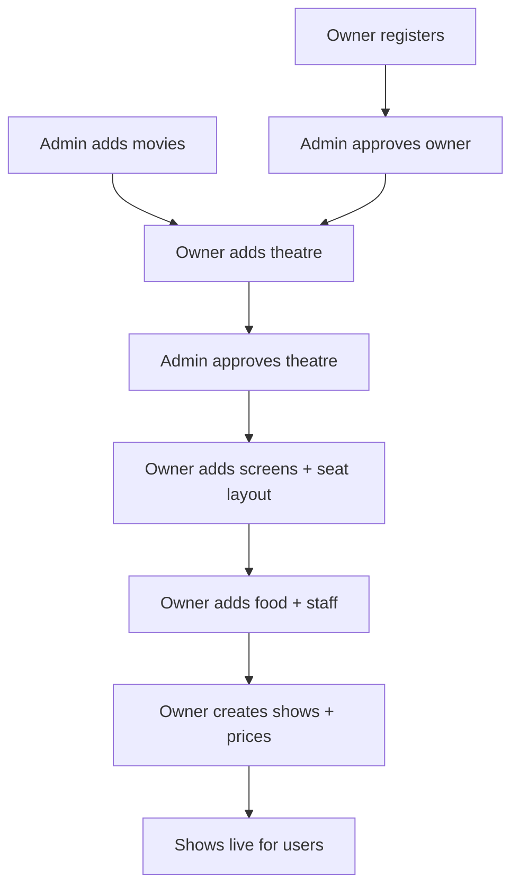
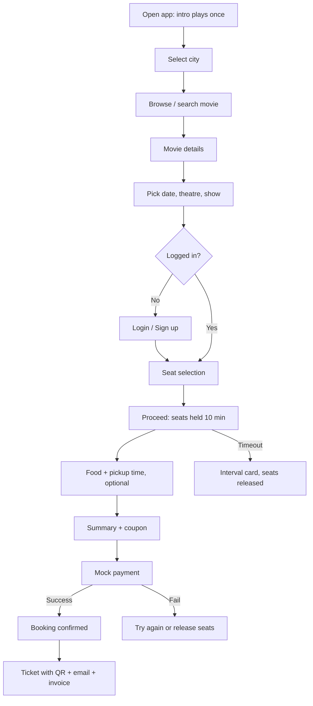
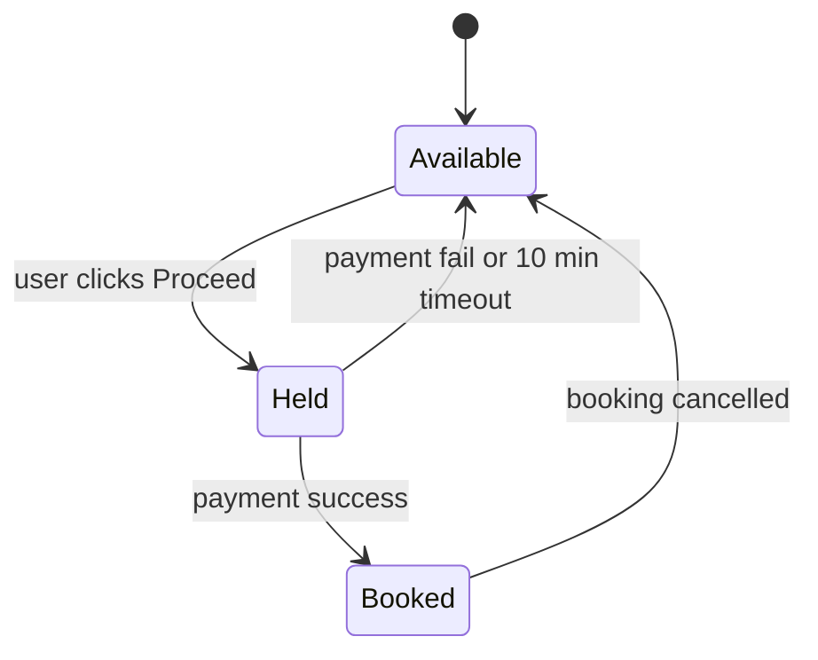
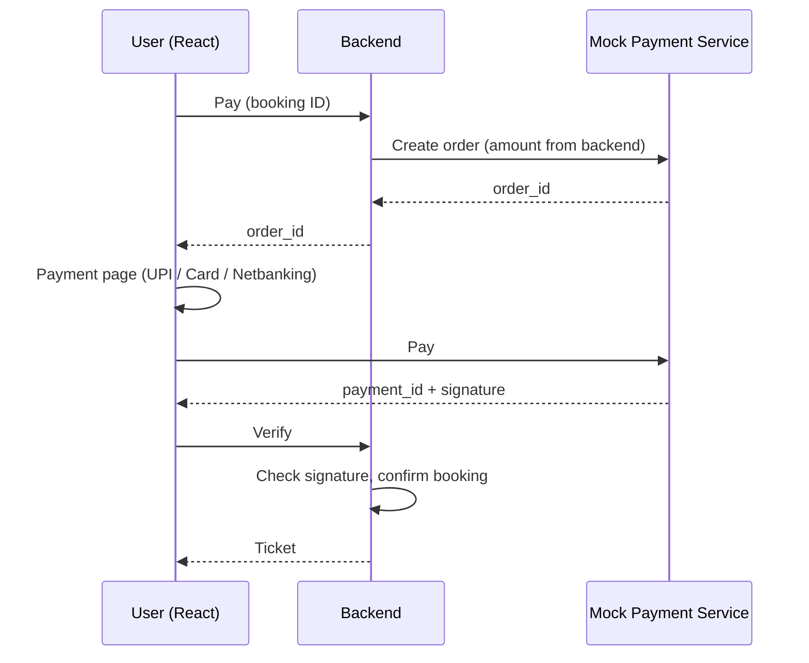
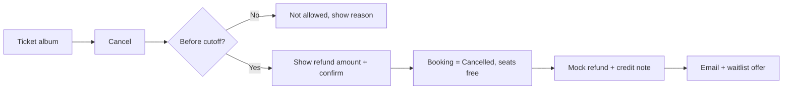
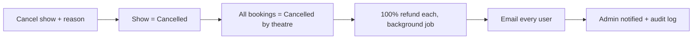
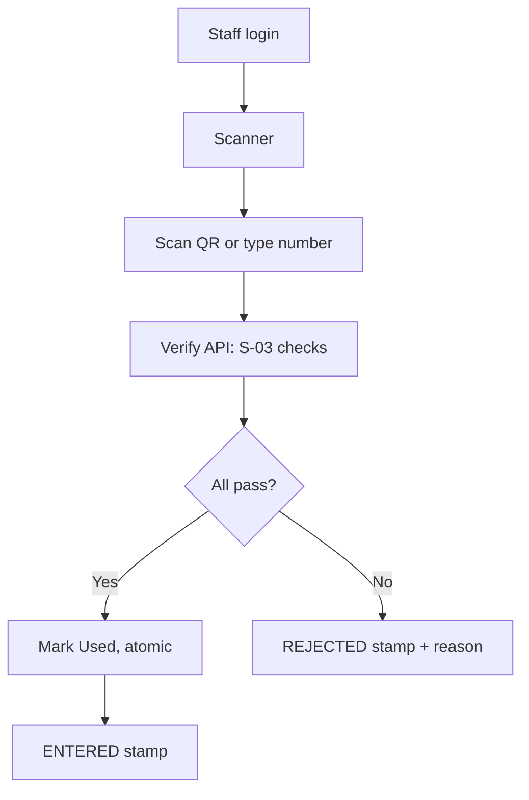
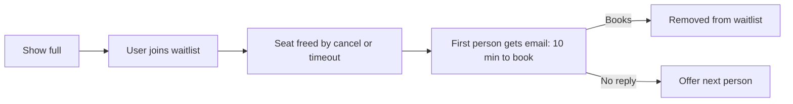
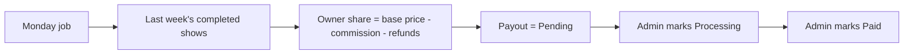

# Talkies – Movie Ticket Booking App: Requirements

Version 2 · 2026-09-28

---

## 0. How to use this document (read first)

This file is the single source of truth for the project. Claude CLI (Claude Code) must follow it.

- Read this file and `docs/progress.md` at the start of every session.
- Every requirement has an ID (for example `U-07`, `SEC-03`, `UI-12`). Use these IDs in `progress.md`, commit messages and code comments.
- Build in the order of **Section 15 (Where to start and build order)**. Do not jump ahead.
- If something is not written here, ask the developer before building it. Do not invent features.
- Values marked **(default)** were chosen as a starting value; they can be changed later in settings or here.
- Text in `[brackets]` means placeholder: use real data from the database.

**Sections**
1. Project summary
2. Tech stack
3. Roles and permissions
4. Business rules (all numbers in one place)
5. User features
6. Theatre Owner features
7. Admin features
8. Gate Staff features
9. Main flows (diagrams)
10. Special features
11. Payments, refunds, payouts and GST
12. Email and notifications
13. Security
14. Non-functional requirements (offline, accessibility, time, images, jobs)
15. Where to start and build order
16. Vintage UI "Talkies" (full design)
17. Decisions and open questions

---

## 1. Project summary

**Talkies** is a movie ticket booking web app for Indian users, with many theatres in many cities (like BookMyShow), built with the MERN stack.

- Users browse movies, pick a show, pick seats, add food, pay (mock payment for now) and get a QR ticket.
- Theatre Owners manage their own theatres, screens, shows, food and staff, and see their own sales.
- Gate Staff scan QR tickets at the theatre gate.
- Admin manages the whole platform: movies, owner and theatre approvals, commission, coupons, reports.
- The whole app has a **nostalgic vintage look** of an old Indian single-screen cinema of the 70s–80s (Section 16).
- Money is fake for now: mock payment page (Razorpay style). Real Razorpay can be added later without changing other code.

---

## 2. Tech stack

| Part | Choice |
| --- | --- |
| Frontend | React (Vite), React Router |
| Styling | Tailwind CSS with the Talkies theme colours and fonts in the config + CSS variables |
| Server data / state | TanStack Query (API data) + Zustand (small UI state like selected seats, sound on/off) |
| Animations | Framer Motion (components) + CSS keyframes (simple loops) |
| Hand-drawn charts | Rough.js |
| Backend | Node.js (current LTS) + Express |
| Database | MongoDB (MongoDB Atlas free tier for cloud) + Mongoose |
| Real-time | Socket.io (live seat map, live dashboards) |
| Validation | Zod (backend, and forms on the frontend) |
| Auth | JWT access token + refresh token (httpOnly cookie), bcrypt |
| Email | Postmark (free plan) via the `postmark` npm package; console log when no key is set |
| Images | Cloudinary (free plan) + multer for uploads |
| QR | `qrcode` (create) + `html5-qrcode` (scan with phone camera) |
| PDF | `pdfkit` (tickets, GST invoices, reports) |
| Excel export | `exceljs` |
| Background jobs | `node-cron` |
| PWA / offline | `vite-plugin-pwa` |
| Tests | Vitest + Supertest + `mongodb-memory-server` |
| Security middleware | helmet, cors, express-rate-limit |

Before installing, check each package's current version and docs. If a package is not suitable, ask before replacing it.

---

## 3. Roles and permissions

There are 4 roles. A visitor who is not logged in is a **guest** (not a role): a guest can only browse.

| Role | Can do | Cannot do |
| --- | --- | --- |
| User | Browse, book, pay, cancel, transfer tickets, waitlist, reviews, badges, ticket album, help | Any owner/admin/staff page |
| Theatre Owner | Own theatres only: screens, seat layouts, shows, food, staff, bookings, reports, payouts | Other owners' data, platform settings, movies list edits |
| Gate Staff | Scan tickets for the theatre they belong to; see check-in result | Anything else |
| Admin | Everything on the platform: movies, approve owners and theatres, commission, GST rates, coupons, users, all reports, payouts | — |

**Permission rules**
- `ROLE-01` Every API checks the role (middleware).
- `ROLE-02` Owner and Gate Staff APIs also check ownership: the theatre must belong to that owner / staff.
- `ROLE-03` Owner account starts as **Pending**; only after Admin approval can the owner add theatres.
- `ROLE-04` Each new theatre starts as **Pending**; only after Admin approval can it have live shows.
- `ROLE-05` Gate Staff accounts are created only by the owner, linked to one or more of the owner's theatres.
- `ROLE-06` Admin accounts are created only by the seed script or by another admin.

---

## 4. Business rules (all numbers in one place)

Put these in a settings collection so admin can change them later (except where noted).

| ID | Rule | Value |
| --- | --- | --- |
| BR-01 | Seat hold time | 10 minutes |
| BR-02 | Max seats per booking | 10 |
| BR-03 | Convenience fee | ₹30 per ticket (goes to the platform) |
| BR-04 | User cancellation cutoff | Up to 2 hours before show start |
| BR-05 | Refund on user cancellation | 75% of ticket price (after discount); food 100%; convenience fee not refunded |
| BR-06 | Refund on show cancelled by owner/admin | 100% of everything (tickets + food + convenience fee) |
| BR-07 | Show cannot be cancelled | After the show has started |
| BR-08 | Gate check-in window | From 30 minutes before start until show end |
| BR-09 | Cleaning break between shows | 15 minutes (default, owner can change per screen) |
| BR-10 | Show end time | Start time + movie duration + cleaning break |
| BR-11 | Platform commission | % set by admin (applies to ticket and food base price, before GST) |
| BR-12 | Owner payout | Every Monday, for the previous week's completed shows |
| BR-13 | Waitlist offer time | 10 minutes per person, then offered to the next person |
| BR-14 | Last-minute deal start | 30 minutes before show start; discount % set by owner (max 50%, default) |
| BR-15 | Ticket transfer allowed | Until 30 minutes before show start; only once per booking; not after "Used" (default) |
| BR-16 | Coupons | One coupon per booking; cannot be combined with a last-minute deal (default) |
| BR-17 | Login rate limit | Max 5 wrong logins per 15 minutes per account + IP |
| BR-18 | Password | Min 8 characters, at least 1 letter and 1 number |
| BR-19 | Access token life | 15 minutes; refresh token 7 days (default) |
| BR-20 | GST rates | Set by admin in settings (ticket, food, convenience fee separately). Not hard-coded. Confirm current rates with a CA. |
| BR-21 | Time zone | Store UTC, show IST (Asia/Kolkata) |
| BR-22 | Show labels (fixed, from start time) | Before 12:00 PM = Morning show · 12:00–3:59 PM = Matinee · 4:00–7:59 PM = First show · 8:00 PM and later = Second show |
| BR-23 | Jubilee badges (watched = ticket scanned "Entered") | 1 = First show · 10 = Regular · 25 = Silver Jubilee · 50 = Golden Jubilee · 100 = Diamond Jubilee |
| BR-24 | Reviews | Only users whose ticket was scanned "Entered" can review that movie; one review per movie per user |
| BR-25 | Email limit | Postmark free plan (about 100 emails per month); keep emails to the list in Section 12 |

---

## 5. User features

| ID | Feature | Details | Done when |
| --- | --- | --- | --- |
| U-01 | Sign up | Name, email, password (BR-18). Verification email with link. Account works only after email is verified. | User can sign up, gets email, link verifies account |
| U-02 | Login / logout | Email + password only. JWT (BR-19). Wrong password limit (BR-17). | Login works; tokens refresh; logout clears cookie |
| U-03 | Forgot password | Email with reset link (valid 30 min, default). | Password can be reset from the link |
| U-04 | Select city | City picker in header; saved for next visit. All lists show only that city. | Changing city changes shows and theatres |
| U-05 | Home page | Coming soon ticker (UI-26), marquee "Now showing" banner, "Now showing" grid, "Coming soon" row. | Home shows real movies of the selected city |
| U-06 | Search and filter | By movie name, language, genre, format (2D/3D), and special show filters (SF-08). | Filters combine correctly |
| U-07 | Movie details | Poster, trailer link, cast, duration, certificate (U, U/A, A), languages, rating and reviews. | Page shows all fields from DB |
| U-08 | Age certificate warning | For "A" movies, show a confirm message before seat selection ("This movie is for adults 18+"). | Message shows for "A" movies only |
| U-09 | Choose show | Pick date (next 7 days), theatre list with show times. Each time shows its old label (BR-22) e.g. "Matinee · 2:30 PM". Full shows show "Housefull" + "Join waitlist". | Show list correct; labels correct |
| U-10 | Seat selection | Live seat map inside the box office window (UI-20) with chair seats (UI-21). States: available, selected, booked, held, blocked. Seat classes with prices. Max seats (BR-02). | Seats update live for all viewers |
| U-11 | Smart seat pick | See SF-03. | — |
| U-12 | Seat hold | "Proceed" holds the seats for BR-01 with a countdown timer. Timeout shows the Interval card (UI-33) and releases seats. | Hold and release work, also after page refresh |
| U-13 | Food and snacks | After seats: theatre's canteen menu (UI-24), quantity + / −, choose pickup time "Before movie" or "Interval" (SF-06). Optional. | Food adds to summary |
| U-14 | Booking summary | Seats, class, food, ticket price, convenience fee, GST lines, coupon or deal, total. Backend recalculates everything (SEC-10). | Totals match backend |
| U-15 | Coupon | Enter code; checked in backend (expiry, usage limit, per-user limit, BR-16). | Valid codes apply, invalid show a reason |
| U-16 | Payment | Mock payment page (Section 11). | Success confirms booking; failure releases seats |
| U-17 | E-ticket | Booking number, QR code (signed), movie, show label + time, theatre, screen, class, seats, food, pickup time. Download as PDF. Sent by email. | Ticket page + PDF + email |
| U-18 | Ticket album (My bookings) | Scrapbook style (UI-28). Upcoming tickets on top with QR; past ones as stubs (Watched / Cancelled / Transferred). | Shows all bookings of the user |
| U-19 | Offline ticket | Upcoming tickets with QR open without internet (NF-01). | Works in airplane mode after one online visit |
| U-20 | Cancel booking | Allowed until BR-04. Shows refund amount before confirming (BR-05). | Seats freed, refund recorded, email sent, credit note made |
| U-21 | Ticket transfer | See SF-02. | — |
| U-22 | Waitlist | See SF-04. | — |
| U-23 | Reviews | Rate 1–5 and write a review (BR-24). Admin can hide reviews (A-12). | Only allowed users can review |
| U-24 | Jubilee badges | BR-23. Shown on profile and in the ticket album. New badge = medal drop animation + email. | Badge appears after the right number of "Entered" scans |
| U-25 | Profile | Edit name and phone, change password, sound on/off (UI-40), reduce motion (UI-41), theme Auto / Day show / Night show (UI-02). | Changes saved |
| U-26 | Delete account | Personal data removed; booking and invoice records needed for GST are kept without personal details. Confirm with password. | Login no longer works; invoices still exist without name/email |
| U-27 | Help and support | FAQ page + "Raise an issue" form linked to a booking. User sees replies and gets email. | Issue created and visible to admin |
| U-28 | Policy pages | Terms, Privacy, Refund and Cancellation, Contact Us (footer links). | Pages exist |

---

## 6. Theatre Owner features

| ID | Feature | Details | Done when |
| --- | --- | --- | --- |
| O-01 | Register as owner | Name, email, phone, business name, password. Status Pending until admin approves (ROLE-03). Email on approval/rejection. | Pending owner cannot add theatres |
| O-02 | Owner dashboard | Box office register style (UI-30): flip-clock cards (tickets sold today, revenue today, seats filled %), today's entries table, show timing insights (SF-01), food sales. | Numbers match DB; update live |
| O-03 | Theatres | Add/edit own theatres: name, city, address, map link, photos, GSTIN, amenities (wheelchair access, parking). Each new theatre is Pending (ROLE-04). | Theatre visible to users only after approval |
| O-04 | Screens and seat layout | For each screen: name, format (2D/3D), cleaning break (BR-09), accessibility flags (wheelchair-friendly). Grid editor: rows × columns; each cell = seat, aisle (gap) or blocked. Seat types with class names: Balcony / First class / Second class (UI-22). Wheelchair spaces marked. | Layout saved and shown the same on the user seat map |
| O-05 | Shows | Pick a movie from the admin's list, screen, date, start time, language, format, subtitles yes/no, special tags (parent-and-baby), price per seat class. End time from BR-10. No overlap on the same screen. Option: create the same show for several dates. | Overlaps are refused with a clear message |
| O-06 | Cancel show | Reason required. Triggers BR-06 for all bookings (flow 9.6). Not after start (BR-07). | All users refunded and emailed |
| O-07 | Canteen (food) | Items: name, photo, price, veg / non-veg, in stock yes/no, combo yes/no. | Items appear on the user food page |
| O-08 | Bookings | See bookings for own shows only; search by booking number; see check-in status. | — |
| O-09 | Gate Staff accounts | Create / block staff logins for own theatres (ROLE-05). | Staff can log in and scan only for their theatre |
| O-10 | Check-in report | Per show: booked vs came (Entered) count. | — |
| O-11 | Food pickup screen | For the canteen counter: scan ticket QR → shows food order → mark "Collected" (SF-06). | Order cannot be collected twice |
| O-12 | Last-minute deals | Turn on per show or for all shows; set discount % (BR-14). | Discount applies automatically at the right time |
| O-13 | Reports | Daily / weekly / monthly sales, food sales, GST report; export Excel and PDF. | Files download with correct numbers |
| O-14 | Payouts | Earnings, commission cut, refunds taken back, payout history and status (flow 9.9). Bank details (account name, account number, IFSC) stored encrypted. | Payout lines match bookings |

---

## 7. Admin features

| ID | Feature | Details | Done when |
| --- | --- | --- | --- |
| A-01 | Admin dashboard | Register style (UI-30) for the whole platform: tickets today, revenue, commission earned, top movies, top theatres, cities. | — |
| A-02 | Movies | Add / edit / mark inactive: title, poster, trailer link, cast, genres, languages, duration, certificate, release date, status (Coming soon / Now showing / Inactive). A movie with shows or bookings cannot be deleted, only made inactive. | Owners can pick active movies |
| A-03 | Owner approvals | See Pending owners; approve / reject with reason; block owners. | Emails sent on decision |
| A-04 | Theatre approvals | See Pending theatres; approve / reject with reason. | — |
| A-05 | Platform settings | All BR values that can change: commission %, convenience fee, GST rates, hold time, cancellation cutoff and refund %, etc. Every change is saved in the audit log. | New values used in new bookings only |
| A-06 | Coupons | Create codes: % or flat off, min amount, max discount, start/end date, total usage limit, per-user limit, cities or theatres. | — |
| A-07 | Users | View, search, block / unblock users. | Blocked users cannot log in |
| A-08 | All bookings | Search by booking number, user email, theatre, date; see payments and refunds. | — |
| A-09 | Payouts | See all owners' payouts; mark Processing / Paid (mock). | Status updates visible to the owner |
| A-10 | Reports | Platform sales, commission, GST, per city / theatre / movie; export Excel and PDF. | — |
| A-11 | Banners and ticker | Home page banners and ticker messages: text, city, start/end date. | Show on home page for the right city and dates |
| A-12 | Review moderation | Hide / show reviews with a reason. | Hidden reviews do not show to users |
| A-13 | Help desk | See issues, reply, mark Open / Solved. | User gets the reply by email |
| A-14 | Audit log | Who did what and when for admin and owner actions (approvals, cancellations, payouts, settings). Read only. | — |

---

## 8. Gate Staff features

| ID | Feature | Details | Done when |
| --- | --- | --- | --- |
| S-01 | Staff login | Email + password; opens straight to the scanner (no intro animation). | — |
| S-02 | Scan ticket | Phone camera scans the QR (`html5-qrcode`). Backup: type the booking number. | — |
| S-03 | Verify | Backend checks, in this order: QR signature valid → booking is for this staff's theatre → time inside BR-08 → status Confirmed (not Cancelled / Transferred-away) → not already Used. | Each failure shows its own reason |
| S-04 | Mark Used | Atomic update (only one scan can win). Save time and staff ID. | Same ticket scanned twice = second is rejected |
| S-05 | Result screen | Valid: green "ENTERED" stamp (UI-35) + movie, screen, seats, food. Invalid: maroon "REJECTED" stamp + reason (e.g. "Already used at 6:05 PM"). Resets after 3 seconds. | — |

---

## 9. Main flows

### 9.1 Setup before users can book



### 9.2 Booking



Login is asked only when the user wants to pick seats, so guests can browse freely.

### 9.3 Seat states and locking



- Seat lock is saved in MongoDB with an expiry time (TTL index), so old holds clear by themselves.
- Holding uses an **atomic** update: only one user can change a seat from Available to Held. Tests must prove this (Section 15, T-02).
- Socket.io room per show: every change is pushed to all viewers of that show.
- "Blocked" seats (set by owner) are never bookable.

### 9.4 Mock payment (Razorpay style)



- PAY-01 The mock service lives in its own module (`server/src/services/payment/`) with the same functions a real Razorpay service would need (createOrder, verifySignature, refund). Swapping to Razorpay later changes only this module.
- PAY-02 Payment page tabs: UPI (any UPI ID), Card (dummy form), Netbanking (bank list). "Processing…" with the film reel (UI-32) for 2–3 seconds.
- PAY-03 Test values: UPI `success@test` = success, `fail@test` = failure; card `4111 1111 1111 1111` = success, any other = failure. (These are our own mock values, not real gateway test values.)
- PAY-04 Every attempt saved in a Payments collection: Created → Success / Failed → Refunded (full or partial).
- PAY-05 Payment safety job (JOB-02).

### 9.5 User cancels



### 9.6 Owner / admin cancels a show



### 9.7 QR check-in



### 9.8 Waitlist



### 9.9 Owner payout



---

## 10. Special features

| ID | Feature | For | How it works |
| --- | --- | --- | --- |
| SF-01 | Show timing insights (Top) | Owner | Hand-drawn chart (Rough.js) of seats filled % by show label (Morning / Matinee / First / Second) and by day of week, last 4 weeks. One simple tip, calculated from data (e.g. "Second show fills best on Saturdays"). No AI; plain rules. |
| SF-02 | Ticket transfer (Top) | User | Enter friend's email (BR-15). If the friend has an account, the booking moves to them; if not, they get an email to sign up and claim it. Old QR stops working at once; a new QR is made. Both get emails. |
| SF-03 | Smart seat pick (Top) | User | User enters number of people (1–10) and a class. App suggests seats together in one row, as close as possible to the middle of the row and the middle rows of that class. If not possible, the best split into 2 groups. User can accept or change. |
| SF-04 | Waitlist | User | Flow 9.8 (BR-13). Max 1 waitlist entry per user per show. |
| SF-05 | Seat view preview | User | When seats are selected, a small simple drawing shows the view of the screen from that row and side (size and angle based on seat position). Generated by code, no photos. |
| SF-06 | Food pickup time | User + Owner | User picks "Before movie" or "Interval". Canteen counter scans the ticket QR (O-11), sees the order, marks "Collected". |
| SF-07 | Last-minute deals | Owner + User | O-12 and BR-14. Deal price shows with an old "Special offer" stamp. |
| SF-08 | Special show filters | User | Filter shows by: subtitles, wheelchair-friendly screen, parent-and-baby show. |

---

## 11. Payments, refunds, payouts and GST

### 11.1 Money split

| Item | Goes to |
| --- | --- |
| Ticket base price − commission % | Theatre Owner |
| Food base price − commission % | Theatre Owner |
| Commission % of ticket + food base price | Platform |
| Convenience fee (BR-03) | Platform |
| Refunds | Taken back from the owner's share (and platform share where it applies) |

### 11.2 Refund amounts

- User cancels (BR-05): 75% of ticket price after discount + 100% food. Convenience fee not refunded.
- Show cancelled (BR-06): 100% of everything.
- Every refund makes a credit note (11.3).

### 11.3 GST invoice

Every confirmed booking gets a GST tax invoice PDF (download in the ticket album, attached to the confirmation email).

| Field | Content |
| --- | --- |
| Invoice number | Unique, in series per financial year, e.g. `INV/2026-27/000123` |
| Seller | Theatre name, address, GSTIN (for tickets and food) |
| Platform | Company name, GSTIN (for convenience fee) |
| Buyer | User name, email, state |
| Lines | Tickets, food items, convenience fee — each with HSN/SAC code |
| Tax | Taxable value; CGST + SGST (same state) or IGST (other state) |
| Total | Amount paid |

- GST-01 Rates from settings (BR-20). Confirm with a CA before real use.
- GST-02 Cancelled or partly refunded booking = credit note PDF.
- GST-03 Monthly GST report for owner and admin (Excel).

---

## 12. Email and notifications

Postmark free plan (BR-25). If `POSTMARK_API_KEY` is empty, emails are printed to the server console instead.

| ID | When | Email |
| --- | --- | --- |
| E-01 | Sign up | Verify email link |
| E-02 | Forgot password | Reset link |
| E-03 | Booking confirmed | Ticket details + QR + invoice PDF |
| E-04 | Booking cancelled by user | Refund amount + credit note |
| E-05 | Show cancelled by theatre | Apology + 100% refund |
| E-06 | Ticket transferred | To sender and receiver |
| E-07 | Waitlist offer | "A seat is free, 10 minutes to book" |
| E-08 | New badge | Badge name |
| E-09 | Owner / theatre approved or rejected | Result + reason |
| E-10 | Help desk reply | Reply text |
| E-11 | Show reminder | 2 hours before show (later, only if email limit allows) |

Emails use the vintage style too: cream background, maroon header "Talkies" in a serif font (email-safe fallback: Georgia), simple layout.

---

## 13. Security

| ID | Area | Rule |
| --- | --- | --- |
| SEC-01 | Passwords | BR-18; bcrypt hash |
| SEC-02 | Tokens | BR-19; refresh token in httpOnly, secure, sameSite cookie |
| SEC-03 | Rate limit | BR-17; also limits on email, booking, payment and scan APIs |
| SEC-04 | Roles | ROLE-01 on every API |
| SEC-05 | Ownership | ROLE-02 on every owner and staff API |
| SEC-06 | Input | Validate all input with Zod; block NoSQL injection (no raw `$` keys from users) |
| SEC-07 | Secrets | Only in `.env` (JWT secrets, QR secret, Postmark key, Cloudinary keys, bank data encryption key). `.env.example` with empty values in git; `.env` never in git |
| SEC-08 | Headers | helmet, CORS allow-list, HTTPS in production |
| SEC-09 | QR | QR holds a signed token (booking ID + signature with a secret), not plain data |
| SEC-10 | Price | Backend always recalculates prices; never trust amounts from the browser |
| SEC-11 | Uploads | Only jpg / png / webp, max 2 MB (default), checked in backend |
| SEC-12 | Bank details | Encrypted in the database; only last 4 digits shown |
| SEC-13 | Audit log | A-14 |

---

## 14. Non-functional requirements

| ID | Topic | Requirement |
| --- | --- | --- |
| NF-01 | Offline ticket (PWA) | App is installable (PWA). Upcoming tickets with QR are saved on the phone and open without internet. |
| NF-02 | Mobile first | Every user and staff screen works on a 360 px wide phone. Owner and admin dashboards work on laptop first, and are usable on tablet. |
| NF-03 | Accessibility | Real buttons and links, labels on inputs, aria-labels on icon buttons, keyboard use, text contrast at least 4.5:1. |
| NF-04 | Colour-blind safe seats | Seat states also have marks: booked ✕, held lock icon, selected tick, blocked dash. Legend shows the same marks. |
| NF-05 | Reduce motion | UI-41. |
| NF-06 | Slow phones | Auto-skip intro and use lighter animations when the browser reports low device memory or "save data" mode. |
| NF-07 | Time | BR-21. All dates in emails, tickets, invoices in IST. |
| NF-08 | Images | Cloudinary (free plan, check current limits). DB saves only URLs. Resize on upload (poster max 800 px wide, default). |
| NF-09 | Performance | Home page loads in under 3 seconds on a normal 4G phone (target). Fonts and posters lazy loaded. |
| NF-10 | Errors | Friendly vintage error pages and messages (UI-36). Server logs errors with request ID. |

### Background jobs (`node-cron`)

| ID | Job | Runs |
| --- | --- | --- |
| JOB-01 | Release expired holds (backup to TTL index) + push seat updates | Every minute |
| JOB-02 | Payment safety check: payment Success but booking not Confirmed → confirm if seats free, else refund + email; payments stuck in Created > 15 min → mark Failed, free seats | Every 5 minutes |
| JOB-03 | Waitlist offers (next person after 10 min) | Every minute |
| JOB-04 | Show cancellation refunds (queue) | Every minute |
| JOB-05 | Last-minute deals switch-on | Every minute |
| JOB-06 | Weekly payouts | Monday 6:00 AM IST |
| JOB-07 | Show reminders (later) | Every 15 minutes |

---

## 15. Where to start and build order

### 15.1 Folder structure

```
booking-app/
├── CLAUDE.md              ← rules for Claude CLI (auto-read)
├── docs/
│   ├── requirements.md    ← this file
│   ├── progress.md        ← daily tracker (tasks, done, next, bugs)
│   ├── database.md        ← collections, fields, indexes (Phase 0)
│   └── api.md             ← all API endpoints (Phase 0)
├── client/                ← React (Vite)
│   └── src/
│       ├── theme/         ← colours, fonts, motion.js (timings)
│       ├── components/
│       │   ├── ui/        ← buttons, cards, stamps, tickets
│       │   └── animations/← CurtainIntro, ProjectorIntro, Seat, TicketTear…
│       ├── pages/
│       │   ├── user/  owner/  admin/  staff/  public/
│       ├── api/           ← API calls (TanStack Query)
│       └── store/         ← Zustand
├── server/
│   └── src/
│       ├── config/  models/  routes/  controllers/
│       ├── services/      ← payment/, email/, pdf/, qr/, upload/
│       ├── middleware/    ← auth, role, ownership, validate, errors
│       ├── jobs/          ← JOB-01 … JOB-07
│       ├── sockets/
│       └── seed/
├── .env.example
└── package.json           ← scripts to run client + server together
```

### 15.2 First-day setup (Phase 0)

1. Create the folder, `git init`, first commit with `docs/requirements.md`.
2. Create `CLAUDE.md` and `docs/progress.md`.
3. Create `client` (Vite + React) and `server` (Express) with the folder structure above.
4. Add Tailwind with the Talkies theme (UI-01 to UI-05) and the three Google Fonts.
5. Connect MongoDB (local or Atlas free tier); add `.env.example`.
6. Write `docs/database.md` (all collections, fields, indexes) and `docs/api.md` (all endpoints) from this file. **Developer reviews them before Phase 1.**
7. Add the seed script skeleton (`npm run seed`).
8. Add test setup (Vitest + Supertest + mongodb-memory-server).

### 15.3 Build phases

Finish and test each phase before the next. After each phase: update `progress.md`, commit, and show the developer.

| Phase | Build | Requirement IDs | Done when |
| --- | --- | --- | --- |
| 0 | Setup, theme base, database + API design, seed + test setup | 15.1, 15.2, UI-01–UI-05 | App runs; DB connects; docs reviewed |
| 1 | Auth and roles; basic vintage layout (header, footer, buttons, cards) | U-01–U-03, O-01, S-01, ROLE-01–06, SEC-01–07 | All 4 roles can log in and see only their pages |
| 2 | Admin movies + approvals + settings; owner theatres, screens, seat layout editor, food, shows | A-02–A-05, O-03–O-05, O-07, BR-09–10, BR-22 | Flow 9.1 works end to end |
| 3 | User browsing | U-04–U-09, SF-08 | Guest can browse real shows by city |
| 4 | Seat map, chair seats, holding, live updates | U-10, U-12, UI-20–UI-22, 9.3, JOB-01, NF-04 | Two browsers see live seat changes; only one can hold a seat |
| 5 | Food, summary, coupons, mock payment, confirm, QR ticket, PDF, email, invoice | U-13–U-17, A-06, 9.4, 11, E-01–E-03, JOB-02 | Full booking works; ticket email arrives |
| 6 | Ticket album, cancellation, show cancellation, refunds, credit notes | U-18, U-20, O-06, 9.5, 9.6, JOB-04, E-04, E-05 | Refund amounts correct |
| 7 | Gate staff scanner + check-in, staff accounts, food pickup, check-in report | S-02–S-05, O-09–O-11, 9.7 | Same QR twice is rejected |
| 8 | Dashboards, reports, payouts, users, audit log | O-02, O-13, O-14, A-01, A-07–A-10, A-14, 9.9, JOB-06 | Numbers match bookings |
| 9 | Special features | SF-01–SF-07, U-11, U-21, U-22, 9.8, JOB-03, JOB-05, E-06, E-07 | Each SF works as written |
| 10 | Vintage polish: intros, all animations, error pages, empty states, badges, ticker, sound, reduce motion | UI-10–UI-47, U-24, A-11, E-08 | Matches the preview design; reduce motion works |
| 11 | Reviews, help desk, policy pages, delete account, offline PWA, slow phones | U-23, U-26–U-28, A-12, A-13, NF-01, NF-06, E-09, E-10 | — |
| 12 | Final: all tests pass, security check, deploy | Section 13, T-01–T-08 | App live on a test URL |

### 15.4 Tests that must exist

| ID | Test |
| --- | --- |
| T-01 | Login, token refresh, role and ownership checks (wrong role = 403) |
| T-02 | Two users hold the same seat at the same time: exactly one wins |
| T-03 | Hold expires after BR-01 and seats become available |
| T-04 | Payment verify: bad signature refused; success confirms booking |
| T-05 | Price and GST calculation (backend) including coupon and deal |
| T-06 | Cancellation refund amounts (BR-05, BR-06) |
| T-07 | QR check-in: valid, wrong theatre, too early, cancelled, used twice |
| T-08 | Show overlap check on the same screen (BR-10) |

### 15.5 Seed data (`npm run seed`)

Test data only, clearly marked as sample: 3 cities, 2 theatres per city, 2 screens each with seat layouts, 6 movies (4 now showing, 2 coming soon), shows for the next 7 days, food items per theatre, 2 coupons, and one login for each role (User, Owner, Gate Staff, Admin). Print the test logins in the console after seeding.

---

## 16. Vintage UI "Talkies"

The whole app (user, owner, admin, staff) feels like an old Indian single-screen cinema of the 70s–80s: paper tickets, marquee bulbs, velvet curtains, box office window, film reels, Housefull board, ledger books. It must still be **easy to read and fast**.

Approved preview (private link, only for the developer to look at): https://claude.ai/artifact/KnKDXTa4T6z5PbcZNBCHUY — Claude CLI cannot open it, so everything is described below.

### 16.1 Design tokens

| ID | Name | Hex | Use |
| --- | --- | --- | --- |
| UI-01 | Paper cream | #F3E9D2 | Main background, ticket paper |
| UI-01 | Curtain maroon | #7B1E1E | Primary buttons, headings, booked seats |
| UI-01 | Marquee gold | #D9A441 | Highlights, bulbs, selected seats |
| UI-01 | Bottle green | #2F5D50 | Success, held seats, ENTERED stamp |
| UI-01 | Ink brown | #3B2A20 | Body text, borders |
| UI-01 | Wood brown | #6B4A2E | Box office frame, armrests |
| UI-01 | Light cream | #E8D9B5 | Available seats, soft panels |
| UI-01 | Stage dark | #1E140E | Intro background, dark mode base |

- UI-02 Theme switch: 3 options — **Auto** (default), **Day show**, **Night show**.
  - Day show = paper cream background, ink brown text. Night show = stage dark / ink brown background, cream text, same accents.
  - Auto follows the device's local time: 6:00 AM–6:59 PM = Day show, 7:00 PM–5:59 AM = Night show. Check every minute and switch by itself.
  - Switch in the header (sun/moon icon) and in Profile. Tapping the icon opens a small menu: Auto / Day show / Night show, with a tick on the current choice.
  - Save the choice: localStorage for guests, user profile when logged in. When logged in, the profile choice wins.
  - Theme change uses a 0.5 s fade; instant when reduce motion is on.
  - Same for all roles.
- UI-03 Fonts (Google Fonts): **Rye** (headings, "Admit one", stamps, Housefull), **Special Elite** (typewriter: movie titles, labels), **Courier Prime** (body text, numbers, prices, tables). Fallbacks: Georgia (Rye), Courier New / monospace (others).
- UI-04 Look: flat design, thin ink borders, light paper texture and film grain (very light, never behind small text), sepia tint on posters. No heavy shadows, no glossy gradients.
- UI-05 Shapes: buttons 6 px radius; cards 8 px; ticket edges with dotted tear line; stamps are bordered text slightly rotated (−6° to −14°).

### 16.2 Intros (user side only)

**UI-10 Where intros play**: only on the first screen when a user opens the website, before Home; once per browser session (sessionStorage flag). Never on owner/admin dashboards, staff scanner or direct links (e.g. a ticket link from email). "Skip" button always visible. Auto-skip on slow phones (NF-06).

**Intro order (decided)**: Projector intro (UI-12) plays first, then the Curtain intro (UI-11) opens onto Home. One "Skip" button skips both and goes straight to Home.

**UI-11 Curtain intro (`CurtainIntro`)**
- Dark stage (#1E140E). Centre: row of blinking gold bulbs, "Talkies" (Rye, gold, ~52 px), "The show is about to begin" (Special Elite), another bulb row.
- Top: fixed maroon pelmet (#5E1515) with "NOW SHOWING" in gold and a row of gold half-circle scallops under it.
- Two curtain halves (each half the width): maroon velvet made with vertical stripes (#8E2626 / #6A1818 / #7B1E1E), thick gold fringe at the bottom, dark line where they meet.
- Animation: halves slide out left and right until about 12% of each stays visible; stage text fades in. About 1.2 s, then Home shows.
- Reduce motion: curtains already open, no movement.

**UI-12 Projector intro (`ProjectorIntro`)**
- Old black-and-white / sepia film look (like an old film reel on aged paper). Background: warm dark sepia paper texture (#2A2118 with light fibre lines). Left and right edges: vertical film strips with sprocket holes.
- Layout top to bottom: cinema screen → clapperboard (only at start) → 2 rows of audience (seen from behind) → projector with 2 reels.
- Sequence (about 9 s, all steps on one timeline):

| Step | Time | What happens |
| --- | --- | --- |
| 1. Clap | 0–1.5 s | Black-and-white striped clapperboard ("TALKIES · SCENE 01 · TAKE 01 · ROLL: [movie]") snaps shut with a small bounce; "ACTION!" flashes in gold |
| 2. Audience sits | 1–2 s | Both rows drop into their seats, one after another |
| 3. Projector on | 1.8–2.2 s | Reels start spinning; light beam flickers on from the lens, over the heads, to the screen |
| 4. Countdown | 2.4–5.2 s | Old film countdown circle with a sweeping line: 3 → 2 → 1 |
| 5. Title + clapping | 5.4–8.3 s | "Talkies" (Rye, maroon) + "Now showing in your city" on the screen; audience raises hands and claps |
| 6. End | 8.5–9 s | Fade out, Curtain intro (UI-11) starts |

- Audience (70s–80s Indian look), simple shapes (head circle, rounded shoulders, 2 hands): men in colourful shirts (mustard, blue, cream, rust, olive, brown) with white collars; women in sarees (green, maroon, rust, purple, blue) with a gold or cream pallu border across the shoulder and a hair bun with white jasmine (gajra). Every head sways slowly (each a little out of step); one person holds a red-and-cream striped popcorn box; clapping about 0.3 s per clap.
- Reels: black reel with 4 spokes, grey wound film between spokes, gold hub; a dark film strip with sprocket holes between the two reels. Projector: dark box with "PROJECTOR" label and a lens on top.
- Beam: soft cream cone (low opacity) with light flicker; heads block the bottom of the beam.
- Reduce motion: final frame only (lit screen with "Talkies", audience seated).

### 16.3 Screens

**UI-15 Home**: dark ticker strip at top (UI-26) → header ("Talkies" logo in Rye maroon, city picker, sound icon, theme switch UI-02) → marquee banner (maroon box, blinking gold bulb rows top and bottom, "Now showing" in gold, movie title in Special Elite, certificate + language, gold "Book tickets" button) → "Now showing" 2-column grid (posters with film-strip holes on top and bottom edges, title, certificate + language) → "Coming soon" row → bottom navigation (Home, Ticket album, Profile).

**UI-16 Movie details**: poster in a thin film-strip frame, sepia tint; title in Special Elite; certificate stamp; trailer button; cast as small "photo cards"; reviews as typewritten notes.

**UI-17 Show list**: theatres as cards; each show time is a small ticket-shaped button with its label ("Matinee · 2:30 PM"); full shows are grey with a small "Housefull" stamp and a "Join waitlist" link; deal shows have a "Special offer" stamp.

**UI-20 Seat selection: box office window**
- Header: back button, movie title, "Matinee · 2:30 PM · [theatre]".
- The seat map sits inside a wooden ticket counter window:
  - Wooden frame (#6B4A2E with a light wood-grain stripe pattern) with an arched (round) top.
  - Inside the arch: dark window with iron grille bars (about 14 vertical grey bars + 1 horizontal bar). Grilles only in the arch, never over seats.
  - A small maroon "TICKETS" board with a gold border hangs from two gold strings in the middle of the grille and gently swings.
  - Below the arch: cream seat area with seat classes (Balcony, First class, Second class), each with its price, rows, aisle gaps, row letters on both sides, and the curved "SCREEN THIS WAY" line at the bottom.
  - Bottom of the frame: darker wooden counter ledge with a half-moon ticket slot.
- Under the window: legend with marks (NF-04). Bottom bar: seat summary ("2 seats: F4, F5"), hold timer, maroon "Proceed" button. Smart seat pick button (SF-03). Seat view preview (SF-05) when seats are selected.

**UI-21 Chair seat (`Seat`)**
- Real `<button>` with aria-label ("Seat F4, First class, available") and aria-pressed.
- 3 parts: backrest (rounded top rectangle, dark border), seat cushion (under the backrest, hinged at its top edge), 2 wooden armrests (thin brown bars left and right).
- Available: cushion folded UP (rotateX about 78°, looks like a thin strip), cream.
- Selected: cushion flips DOWN (rotateX 0°), backrest and cushion gold, tick mark. 280 ms with a small bounce.
- Booked: maroon, cushion down, ✕ mark, not clickable. Held: bottle green, cushion up, lock mark, not clickable. Blocked: not drawn (empty space) or dashed outline.
- About 30 × 32 px on phones, 3 px gap. CSS 3D (perspective on button, rotateX on cushion). Reduce motion: colour change only.

**UI-22 Seat class names**: owner sets a class name for each seat type: Balcony, First class, Second class. Seat map, ticket and invoice show the class name.

**UI-23 Booking summary**: looks like an old handwritten bill on ruled paper: lines for tickets, food, fee, GST, discount, total in bold.

**UI-24 Canteen (food) page**: old theatre canteen chalkboard: dark green board, chalk-style white text, prices like chalk; items still have photo, veg/non-veg mark, price and + / − buttons. Pickup choice "Before movie / Interval".

**UI-25 Payment page**: tabs UPI / Card / Netbanking in a simple paper card; "Processing…" with spinning film reel (UI-32).

**UI-26 Coming soon ticker**: thin dark strip on Home, cream typewriter text scrolling right to left (coming soon movies, bookings opening, deals, admin messages). Pauses on hover or tap. Reduce motion: one message at a time, no scrolling.

**UI-27 Booking confirmed**: "Booking confirmed" (Rye maroon) + "Your ticket is also sent to your email." Paper ticket (cream, maroon border): "Admit [n]", movie, show label + time, theatre, screen, class, seats, food + pickup, QR, booking number; right side counterfoil with dotted line, ticket number and total — it tears off (UI-34). Badge card when a new badge is earned. Buttons: Download ticket, Transfer to a friend, Back to home.

**UI-28 Ticket album**: scrapbook: cream pages; each booking a paper ticket "pasted" with a small tape piece, slightly tilted. Upcoming (full ticket with QR) on top; past as stubs with stamps "Watched" / "Cancelled" / "Transferred". Tap for details and invoice. Badges shown at the top as metal medals.

**UI-29 Profile**: medals (badges), settings (sound, reduce motion, theme UI-02), account.

**UI-30 Owner and admin dashboards: box office register**
- Left sidebar (ink brown): logo, menu items for that role.
- Main area: ruled ledger paper (thin blue-grey lines every 32 px) with a red margin line on the left.
- Title "Box office register" (Rye maroon), theatre name and date (Special Elite), main action button (e.g. "+ New show").
- Flip-clock number cards (UI-37).
- Tables look like register pages with column lines; numbers in Courier Prime; status as tilted rubber stamps: Paid / Approved (green), Pending (dark mustard #8A5A00), Cancelled / Rejected (maroon).
- Charts hand-drawn with Rough.js (ink brown and maroon, gold for highlight), drawn in once on load.

**UI-47 "Behind the scenes" page** (public, link in the footer): designed like an old cinema blueprint: blue paper, white lines, typewriter labels (Special Elite). Shows the architecture diagram, the tech stack (Section 2) and how seat locking works (9.3). Built in Phase 10.

**UI-31 Staff scanner**: full-screen camera box framed like an old ticket window; big "Type booking number" link; result stamps (UI-35).

### 16.4 Animations (all)

Rules for all: Framer Motion + CSS keyframes; all timings in `client/src/theme/motion.js`; only `transform` and `opacity`; never block clicks; every animation has a reduce-motion fallback (UI-41).

| ID | Component | When | What | Time | Reduce motion |
| --- | --- | --- | --- | --- | --- |
| UI-11 | CurtainIntro | App open | See 16.2 | 1.2 s | Open, still |
| UI-12 | ProjectorIntro | App open | See 16.2 | ~9 s | Final frame |
| UI-13 | FilmCountdown | Loading > 500 ms | Countdown circle, sweeping line, 3-2-1, grain | 1 s per number, loops | "Loading…" text |
| UI-14 | MarqueeBulbs | Banners, headings | Gold bulbs blink one after another | 1.2 s loop | Bulbs on, still |
| UI-21 | Seat | Select / unselect | Cushion flips down / up | 280 ms | Colour only |
| UI-32 | FilmReel | Processing payment | Reel spins | 1 s per turn | Still reel |
| UI-33 | IntervalCard | Hold timeout | Old "INTERVAL" title card fades in with "Your seat hold time is over. Seats are released." + "Pick seats again" | 400 ms | Plain fade |
| UI-34 | TicketTear | Booking confirmed | Counterfoil tears along dotted line, drops a little and fades | 800 ms, starts after 300 ms | Full ticket |
| UI-35 | EnteredStamp | Gate scan | Big stamp drops from scale 2 to 1, tilted −12°, small screen shake; green ENTERED or maroon REJECTED; short vibration where supported (Android Chrome yes, iPhone Safari no); optional thud sound; resets after 3 s | 500 ms | Stamp, no movement |
| UI-37 | FlipNumber | Dashboards | Each digit flips like an old flip clock on load and on live updates | 600 ms | Number changes |
| UI-38 | HousefullBoard | Show full | Wooden "HOUSEFULL" board swings in from top on two strings and settles | ~900 ms | No swing |
| UI-39 | Medal drop | New badge | Medal drops in and settles | 600 ms | Appears |
| UI-42 | ProjectorBeam | Mouse over movie card (desktop only) | Soft warm light cone from the top of the card with floating dust | Hover | None |
| UI-43 | Ink chart draw | Dashboard charts | Rough.js chart draws in | 800 ms | Shows directly |
| UI-02 | Theme change | Day show ↔ Night show (switch or Auto) | Whole page cross-fades (opacity) | 500 ms | Instant |
| UI-45 | FilmGrain | Always, whole site | Very light grain + soft flicker (CSS only) | Loop | Off |
| UI-46 | SepiaPoster | Hover (desktop) / tap (phone) on a poster | Sepia poster turns full colour (done with opacity: colour layer fades in) | 600 ms | Instant colour change |

### 16.5 Messages with an Indian touch (English)

**UI-36 Error pages and messages**

| Case | Message | Button |
| --- | --- | --- |
| Server error (500) | Sorry for the interruption. Our projector operator is fixing the reel. Please try again. | Try again |
| Page not found (404) | This reel is missing from the projector room. | Go to home |
| No internet | Power cut! Waiting for the generator… (auto-retries) | Retry |
| Payment failed | The ticket counter window just closed. Please try again. | Try payment again |
| Session expired | Interval over! Please log in again to continue the show. | Log in |

- The 500 page shows an old wooden-box TV with rabbit-ear antennas, black-and-white static, then test colour bars. Do NOT use the real Doordarshan logo or name, only the old TV style.

**UI-44 Empty states**

| Screen | Message |
| --- | --- |
| No shows for this date | No shows today. The projector is resting. |
| No bookings yet | Your ticket album is empty. Book your first show! |
| No search results | This reel is not in our cans. Try another name. |
| No food items | The canteen is closed for now. |
| Owner: no shows | Your screen is dark. Add your first show. |

### 16.6 Sound and motion settings

- UI-40 Sounds (off by default): projector whirr (intro/loading), clapperboard clap and audience applause (projector intro), ticket punch (booking confirmed), stamp thud (gate scan). Speaker icon in the header turns sound on/off; saved per user. Short (under 2 s), low volume, never before the user's first click (browsers block it). Use free sound files whose licence allows use in apps; write the source of each file in `docs/credits.md`.
- UI-41 Reduce motion: setting in profile + follows the phone/browser "reduce motion" setting. When on, use the fallbacks in 16.4.

### 16.7 Vintage extras

- UI-45 Film grain + flicker: very light grain and soft flicker over the whole site. CSS only, `pointer-events: none` (never blocks clicks). Off when reduce motion is on (UI-41) or on slow phones (NF-06). Never lowers text readability (contrast stays at least 4.5:1).
- UI-46 Sepia posters: posters show in sepia; on hover (desktop) or tap (phone) they turn to full colour in 0.6 s, like old film coming alive.
- UI-47 "Behind the scenes" page: see 16.3.

### 16.8 UI rules

- Text always easy to read: contrast 4.5:1; textures very light and never behind small text.
- Touch targets at least 44 × 44 px.
- Animations short (under 1 s) except the intros and loops.
- Same vintage look on every screen, but dashboards stay clean and fast for work.

---

## 17. Decisions and open questions

### Decisions

| Topic | Decision |
| --- | --- |
| Stack | MERN (Section 2) |
| Theatres | Many theatres in many cities |
| Roles | User, Theatre Owner, Gate Staff, Admin |
| Login | Email + password only |
| Payment | Mock Razorpay-style service; real Razorpay later |
| Email | Postmark free plan |
| Images | Cloudinary free plan |
| Food and snacks | In version 1 |
| Cancellation | Until 2 h before show; 75% ticket refund |
| Convenience fee | ₹30 per ticket |
| Theme | "Talkies" vintage nostalgic theme on all screens |
| Intros | User side only, once per session |
| Intro order | Projector intro first, then Curtain opens onto Home; one Skip button skips both |
| Progress tracking | `CLAUDE.md` + `docs/progress.md` + git commits (not Excel) |

### Open questions (ask the developer; do not decide alone)

- [ ] Commission % starting value.
- [ ] GST rates and HSN/SAC codes (confirm with a CA).
- [ ] Hosting for the test URL (Phase 12).
- [ ] UI-45 grain covers the whole site, but UI-04 and 16.8 say texture is "never behind small text". Is very light grain behind small text OK if contrast stays 4.5:1?
- [ ] UI-46 on phones: tapping a poster usually opens the movie. Should the first tap show colour and the second tap open the movie, or should the tap open the movie straight away?
